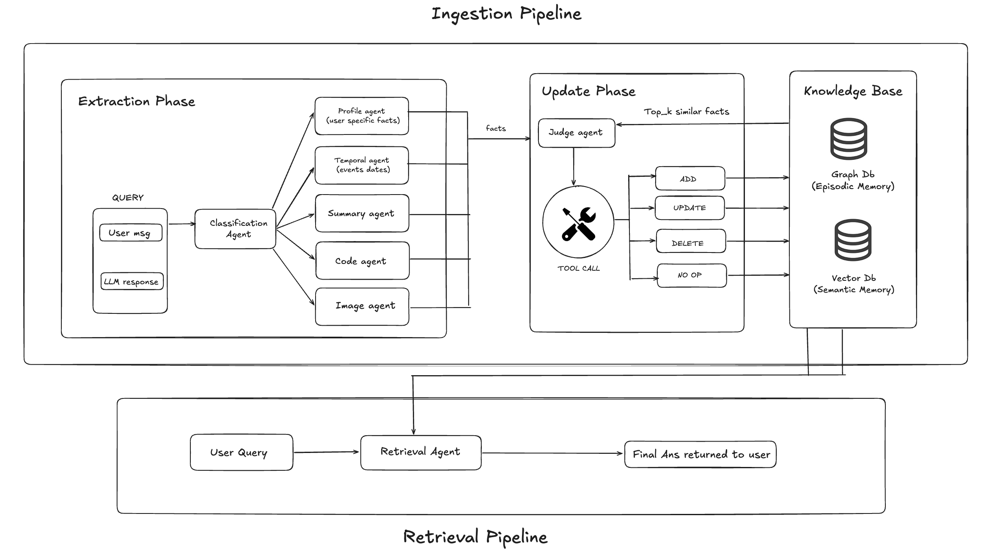

<div align="center">
  <h1>XMem</h1>
  <p><strong>The Universal Unified Memory System for AI Agents & Humans</strong></p>
  <p>Available for <a href="#python-sdk-clientxmem">Python</a> • <a href="#typescript-sdk-xmemsdk">TypeScript</a> • <a href="#go-sdk-githubcomxmemsdk-go">Go</a> • <a href="#2-the-chrome-extension">Chrome</a></p>
</div>

---

## What is XMem?

LLMs are brilliant, but they suffer from "goldfish memory." If you switch from ChatGPT to Claude, or move from your IDE to a web interface, your AI loses all context about you, your past conversations, and your codebase. 

**XMem** solves this by providing a centralized, universally accessible memory layer. It works silently in the background to capture, classify, and store your facts, events, and code, and then surfaces them dynamically exactly when you need them.

### The "Aha!" Practical Use Cases
- **The Omnipresent Assistant:** You tell ChatGPT about your new puppy. Tomorrow, you ask Claude for a weekend itinerary. XMem's Chrome extension detects you typing, pulls the fact about the puppy from your unified memory, and injects it so Claude suggests dog-friendly parks.
- **The Code Oracle ("XIDE"):** XMem scans your local Git repository and builds an AST (Abstract Syntax Tree), storing your code in a dedicated Pinecone namespace. When you ask a coding question, XMem seamlessly retrieves your personal code snippets and injects them directly into your context, leaving no messy traces behind.
- **The Agentic Backbone:** You are building an autonomous research agent. Simply drop in the XMem Python SDK, and your agent gets instant access to long-term memory spanning vector graphs (Pinecone), document stores (MongoDB), and knowledge graphs (Neo4j).

---

## Watch the Demo

<video src="demo.mp4" controls="controls" width="100%"></video>

---

## Core Features

### Seamless Chrome Extension (Real-Time Memory)
Stop copy-pasting your context. The XMem Chrome extension brings memory to where you already work (ChatGPT, Claude, Gemini, DeepSeek, Perplexity):
- **Live Search & Inject:** As you type, XMem processes your input, debounces the search, and shows a floating chip. Click to inject relevant memories right into your prompt with zero friction.
- **Xingest (Background Auto-Save):** Hit "Send" on ChatGPT, and XMem asynchronously captures the turn. It uses a silent background queue to extract facts and summarize the conversation without disrupting your UI.

### Intelligent Agent Routing
Not all memory is the same. XMem's **Classifier Agent** analyzes incoming data and routes it to the correct "intent domain":
- **`profile`**: Permanent user facts (identity, traits, pets, preferences).
- **`temporal` / `event`**: Time-based occurrences ("I got promoted yesterday").
- **`code`**: Software engineering context, snippets, and project structures.
- **`summary`**: Compressed representations of long conversations.

### Multi-LLM with Smart Fallback
Xmem orchestrates memory generation and retrieval using a robust **LLM Registry** built for reliability.
- **Supported:** Gemini, Claude, OpenAI, and Amazon Bedrock models.
- **Fallback:** Configure your `FALLBACK_ORDER` (e.g., `gemini -> claude -> bedrock -> openai`). If an API fails or rate-limits, XMem automatically shifts to the next provider so your memory pipeline never breaks.

---

## Benchmarks

Tested on LongMemEval-S and LoCoMo benchmarks. Xmem consistently outperforms existing memory solutions (such as Zep, Mem0, Memobase, Supermemory) and full-context models across all reasoning categories.

### LongMemEval-S Benchmark

| Category | Xmem | Zep | Full Context | Mem0 | Memobase | Supermemory |
| :--- | :--- | :--- | :--- | :--- | :--- | :--- |
| Single-Session User (overall) | **97.1** | 92.9 | 81.4 | 74.2 | 68.5 | 71.8 |
| Single-Session Assistant | **96.4** | 80.4 | 94.6 | 72.1 | 65.3 | 69.7 |
| Single-Session Preference | **70.0** | 56.7 | 20.0 | 42.3 | 38.1 | 45.6 |
| Knowledge Update | **88.4** | 83.3 | 78.2 | 62.8 | 58.4 | 60.1 |
| Temporal Reasoning | **76.7** | 62.4 | 45.1 | 48.9 | 42.7 | 51.3 |
| Multi-Session | **71.4** | 57.9 | 44.3 | 39.5 | 35.2 | 41.8 |

### LoCoMo Benchmark

| Category | Xmem | Zep | Full Context | Mem0 | Memobase | Supermemory |
| :--- | :--- | :--- | :--- | :--- | :--- | :--- |
| Single Hop | **65.6** | 52.3 | 58.1 | 45.7 | 40.2 | 48.9 |
| Multi-Hop | **69.2** | 54.8 | 61.5 | 43.1 | 38.6 | 46.2 |
| Temporal | **73.0** | 58.4 | 49.7 | 51.2 | 44.8 | 53.5 |
| Open Domain | **55.7** | 44.1 | 52.3 | 38.6 | 33.9 | 41.4 |

---

## Architecture Under the Hood



XMem is designed to be highly extensible and fault-tolerant, orchestrating multiple systems into a unified memory network. Here is how XMem works:

1. **API Layer**: A fast HTTP routing layer built with FastAPI exposes the endpoints (`ingest`, `retrieve`, `search`) invoked by SDKs, local tools, and extensions.
2. **Ingestion Pipeline (Xingest)**: 
   - A background queue receives asynchronous conversation turns or Git repository code scans.
   - The **Classifier Agent** intercepts text and extracts profile facts, temporal events, and summaries.
   - Vectors and metadata are pushed into dedicated namespaces within Pinecone (Vector database) for semantic matching.
3. **Retrieval Pipeline**: 
   - When a user query is dispatched (e.g., from the Chrome extension), XMem executes the `SearchSnippet` tool to perform intent-driven lookup across targeted Pinecone namespaces.
   - The top-*k* retrieved results from vector indices, and optional document (MongoDB) or graph (Neo4j) references, are aggregated.
   - These results are synthesized by the backend into an injected context for the active standard LLM, outputting the final response with cited memories.
4. **Resiliency & Fallback Mode**: Every LLM request during ingestion classification or retrieval synthesis passes through the Registry. If a primary service (like Google Gemini) is unavailable, it reroutes dynamically to Anthropic, OpenAI, or Bedrock, ensuring data safety and constant availability.

---

## Ecosystem & Installation

XMem consists of a powerful central backend, ubiquitous client extensions, and developer-friendly SDKs.

### 1. The XMem Server (Backend)
The brain of the operation. Written in Python, it manages the API, database connections, and background LLM agent processing.

```bash
# Clone the core repo
git clone https://github.com/your-username/xmem.git
cd xmem

# Install (requires Python 3.11+)
pip install -e .

# Start the server (default: localhost:8000)
uvicorn src.api.app:create_app --factory --host 0.0.0.0 --port 8000
```

**Configuration (`.env`):**
```ini
# Core LLM Providers
GEMINI_API_KEY=your_gemini_key
CLAUDE_API_KEY=your_claude_key
DEFAULT_MODEL_MODE=gemini-2.5-flash-lite  # Or any supported variant

# Memory Stores
PINECONE_API_KEY=your_pinecone_key
PINECONE_INDEX_NAME=xmem-index
NEO4J_URI=bolt://localhost:7687
MONGODB_URI=mongodb://localhost:27017
```

### 2. The Chrome Extension
Brings XMem to your browser natively.

```bash
cd xmem-extension
npm install
npm run build
```
*Load the `dist/` folder into Chrome via `chrome://extensions/` -> "Load unpacked". In the extension popup, link it to your running server (e.g., `http://localhost:8000`).*

### 3. Developer SDKs
Build your own tools with our official zero-config client SDKs. Every SDK identically exposes the core commands: `ingest`, `retrieve`, and `search`.

#### Python SDK (`client/xmem`)
```python
from xmem import XMemClient

client = XMemClient(api_url="http://localhost:8000")

# Asynchronous Background Ingestion
client.ingest(
    user_query="I love using standard Go libraries instead of bulky frameworks.",
    agent_response="That's a sound architectural choice.",
    user_id="dev_42"
)

# LLM-Generated Answers backed by Memory
answer = client.retrieve(query="What is my style preference in Go?", user_id="dev_42")
print(answer.answer) # "You prefer standard libraries mapped to your profile."
```

#### TypeScript SDK (`@xmem/sdk`)
```typescript
import { XMemClient } from "@xmem/sdk";

const client = new XMemClient("http://localhost:8000");
const hits = await client.search({
  query: "python backend architecture",
  domains: ["code", "summary"],
  user_id: "dev_42"
});
```

#### Go SDK (`github.com/xmem/sdk-go`)
```go
client := xmem.NewClient("http://localhost:8000", "")
answer, _ := client.Retrieve(xmem.RetrieveParams{
    Query:  "Did I ever mention my dog?",
    UserID: "dev_42",
})
```

---

## Contributing

We welcome contributions to make universal AI memory a reality:
- **Dev Env**: Run tests using `pytest` with dummy API keys (`GEMINI_API_KEY=dummy pytest`).
- **Extensions**: PRs for new IDE extensions (VSCode/JetBrains) using the SDK are highly encouraged.

> **Note:** The XMem system is currently in Active Development. 

<div align="center">
  <i>Forget forgetting. Build with XMem.</i>
</div>
